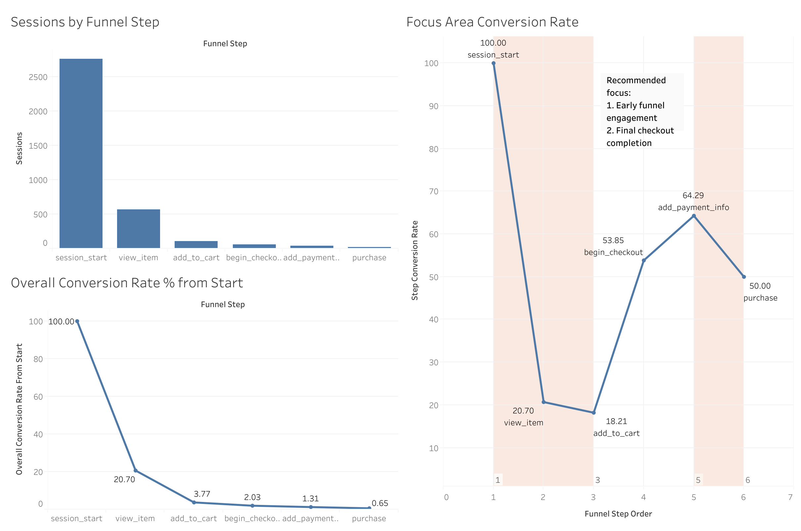

# Conducting a funnel analysis on the GA4 e-commerce dataset

## Executive Summary
This project analyzes how users progress through an e-commerce purchase funnel using the Google Merchandise Store GA4 sample dataset from BigQuery Public Datasets. Using BigQuery SQL, I transformed raw event-level GA4 data into a session-based funnel summary and calculated both overall and step-by-step conversion/drop-off rates. The analysis found that only 0.65% of starting sessions completed a purchase, with major drop-offs occurring before users reached `add_to_cart` and again between `add_payment_info` and `purchase`. Step conversion improved after `add_to_cart`, suggesting that cart additions may represent a key commitment point where users show stronger purchase intent. Based on these findings, the project recommends improving early-funnel product engagement and reducing final-stage checkout friction to increase purchase conversion.

## Project Guide
I have written this chapter in order to make it easier to navigate through the different sections of this project.

`sql/` - This folder contains all the SQL queries I used to prepare, transform, and extract the csv file: `data/funnel.csv`, which is the main csv used for analysis and visualization in this project. The SQL queries, comments, and files are ordered and written in a way to show how I progressed through the project, starting from 01.01 to 03.03, which the latter makes final SQL query that outputs the main csv file used for analysis and visualization.

`data/` - This folder holds the main csv file used for analysis and visualization in this project. The SQL query that outputs the csv file in this folder is located in `sql/03_funnel_analysis.sql`.

`notebooks/` - This folder contains Jupyter notebook(s) that I used mainly for data analysis and visualization.

`visuals/` - This folder contains the visuals outputted from the Jupyter notebook(s) in the `notebooks/` folder.

`tableau/` - This folder contains the Tableau workbook that I used for data visualization.

## Analysis
### Key Findings
Looking at `/visuals/overall_conversion_rate_from_start.png` and `/sessions_by_funnel_step.png`, we can see that the data shows a pretty expected funnel drop off as users move down the funnel, with the the steepest drop off rate ocurring between the first and second stage of the funnel. This is expected as the first state of the funnel serves as a broad entry point for users.

What I find interesting is the `step_conversion_rate_line_chart.png` chart, which shows the conversion rate relative to the previous stage of the funnel. We can see how the difference in intent between users before add_to_cart and after add_to_cart, is quite significant. We can analyse this further by recalling from my Behavioural Decision Making course in my exchange studies where I came across the concept of "Prospect Theory", where users are more likely to take action (in this case, move down the funnel) when they perceive that they have already invested in something. This action of adding an item to the cart can be seen as an investment already, which can explain the higher conversion rates in the later stages of the funnel.

### Recommendations
Based on the `step_conversion_rate_line_chart.png`, my recommendation focuses on two main areas of the funnel: the early-stage journey from `session_start` to `add_to_cart`, and the final-stage journey from `add_payment_info` to `purchase`.

The first area is important because the largest drop-offs happen before users add an item to their cart. This suggests that many users either do not reach product pages or do not feel enough intent to add a product to cart. The second area is important because, even after users enter payment information, only half of those sessions complete a purchase.

Using Prospect Theory as a behavioural lens, the strategy should focus on making add_to_cart feel more valuable and meaningful, while also increasing the likelihood that users complete the final purchase. If `add_to_cart` acts as a reference point shift where the product starts to feel more personally relevant or partially “owned,” then the business should focus on creating that sense of commitment earlier in the funnel. At the same time, the final payment-to-purchase stage should reduce anything that might make users feel they are risking a loss, such as unexpected costs, unclear delivery information, or lack of trust signals.

## Limitations
- This analysis uses the Google Merchandise Store GA4 e-commerce dataset from BigQuery Public Datasets, which has been obfuscated and made to emulate what a real world dataset would look like. 
- The analysis only used a single day of data (2021-01-31) for this analysis, which may not be representative of the overall user behavior on the website.
- The analysis only focuses on the core funnel events, and does not take into account other factors such as device type, traffic source, etc.
- The analysis also assumes that the funnel steps are linear and that users only go through the funnel in a specific order, which may not always be the case in reality.